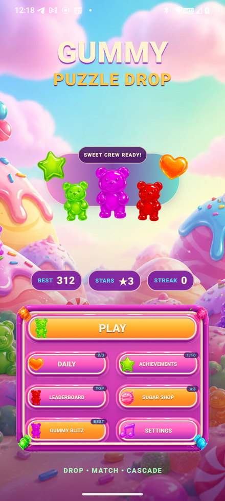
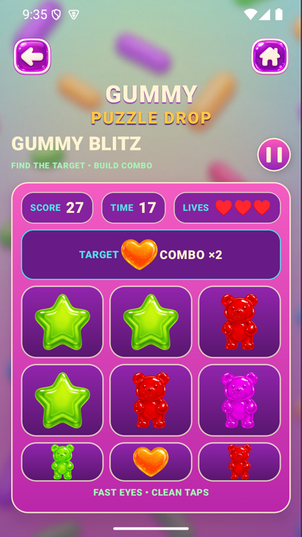
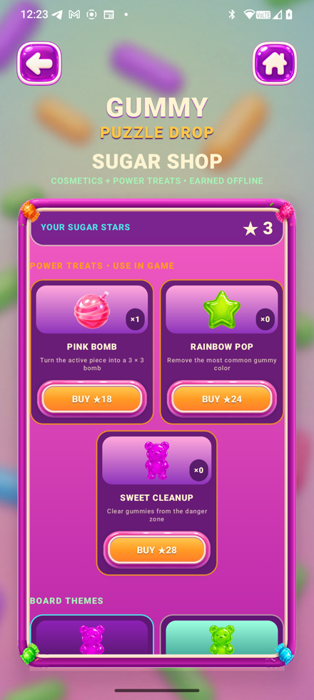
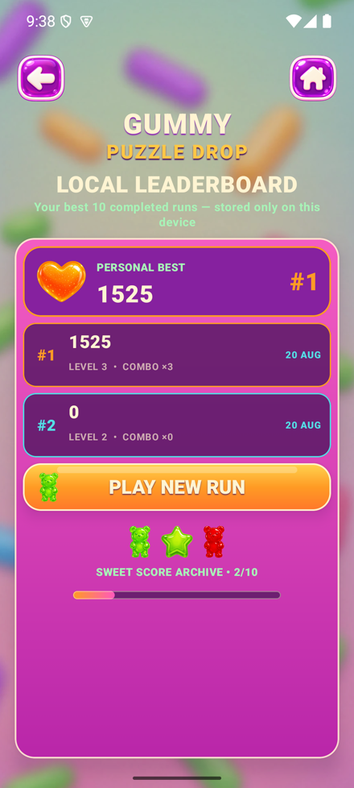

# Gummy Puzzle Drop

A falling-block puzzle game where four-cell gummy shapes drop onto an 8x16 board and clear only through horizontal or vertical Match-3, not full-row clears.

Players drag to move, tap to rotate with wall kicks, and swipe down for a hard drop, using Hold, Next-piece preview and a landing ghost to plan ahead. Locked candies fall independently after every clear, chaining cascades and combo scoring; a x3 combo awards a playable Pink Bomb that detonates a 3x3 area. Around the core loop sits a full offline meta layer: achievements, rotating daily goals, a local leaderboard, a cosmetic-only shop, consumable Power Treats, and a standalone 20-second Gummy Blitz mini-game.

## Screenshots

<p align="center">
  
  
  
  
</p>

## Features

- Rigid four-cell falling pieces on an 8x16 board (14 visible + 2 hidden spawn rows), 7-bag piece randomizer
- Match-3-only clearing (no row clears) with independent per-column gravity and multi-step cascades
- Combo scoring with a playable Pink Bomb reward at combo x3 (3x3 area clear)
- Hold/swap, Next preview, landing ghost, and progressive level speed-up every 10 locked pieces
- Ten permanent achievements, three rotating Daily Sugar Rush goals with a streak counter, and a local top-10 leaderboard
- Cosmetic-only Sugar Shop (board themes, drop effects) plus three consumable Power Treats (Pink Bomb, Rainbow Pop, Sweet Cleanup) bought with earned Sugar Stars
- Gummy Blitz: a deterministic 20-second tap mini-game with combo, lives and score-tier rewards
- Fully offline: no account, backend, network permission, ads or real-money purchases

## Tech Stack

- **Language:** Kotlin
- **Platform:** Android (minSdk 24, targetSdk 35)
- **Engine / framework:** Jetpack Compose, with a deterministic Android-free Kotlin engine underneath
- **Build:** Gradle (Kotlin DSL)
- **Persistence:** AndroidX DataStore

## Project Structure

```
app/src/main/kotlin/.../game/   # Deterministic, Android-free puzzle engine (board, pieces, matching, combos)
app/src/main/kotlin/.../ui/     # Jetpack Compose screens, HUD, shop, leaderboard
docs/                            # Architecture, master spec, asset manifest
design/originals/                # Preserved supplied source designs
```

## Building

```bash
git clone https://github.com/brah1995u/gummy-puzzle-drop.git
cd gummy-puzzle-drop
./gradlew assembleDebug
```

The APK lands in `app/build/outputs/apk/debug/`.

## Status

Feature-complete: core puzzle loop, cascades, combos, achievements, daily goals, leaderboard, shop, Power Treats and the Gummy Blitz mini-game are all implemented, backed by a 53-test deterministic engine suite plus passing lint and release-assembly checks.
